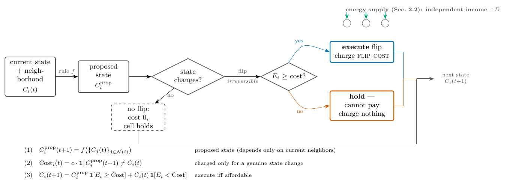
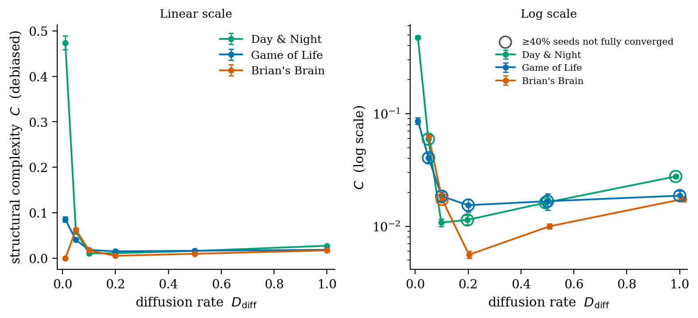
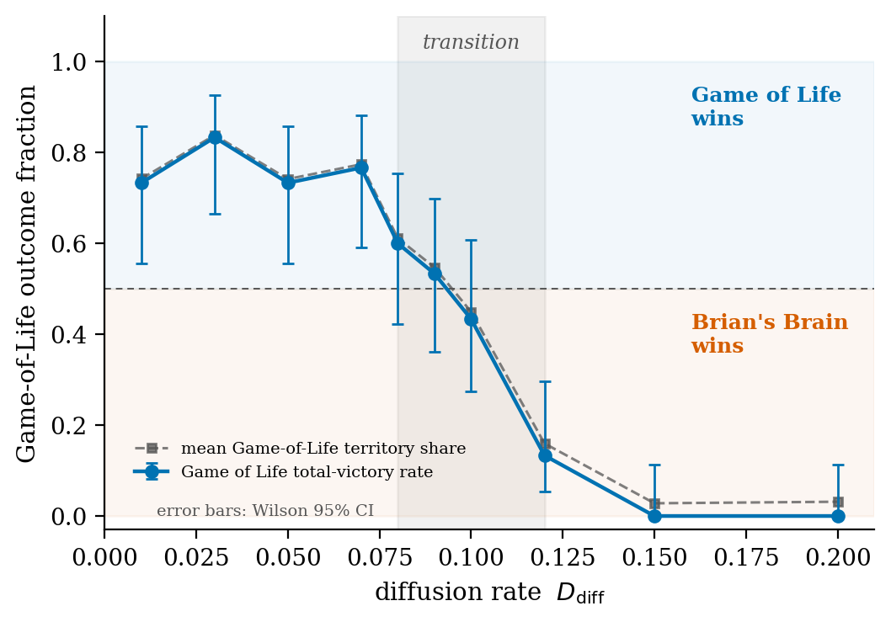
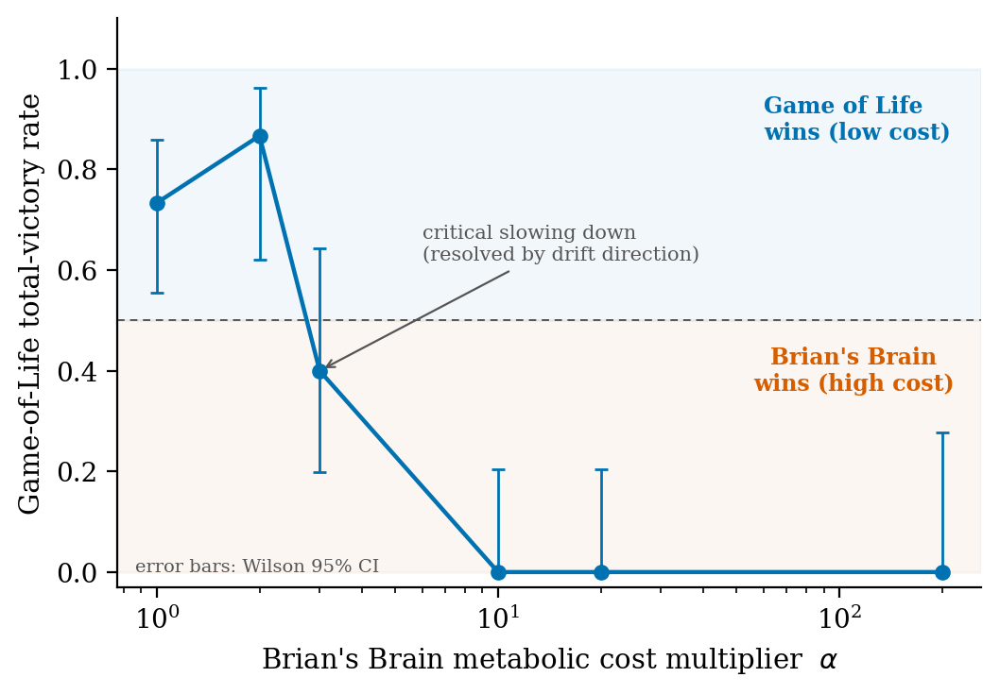
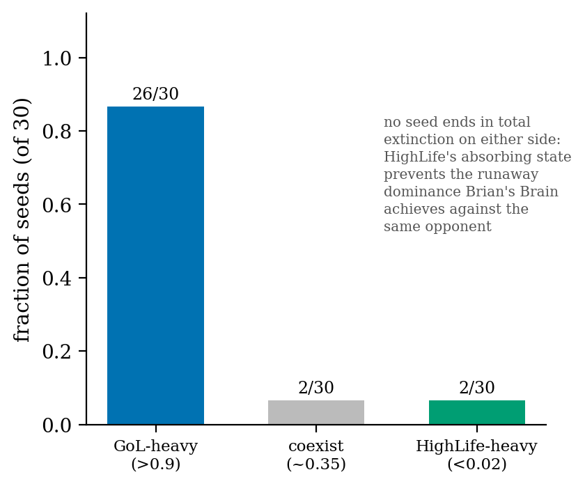
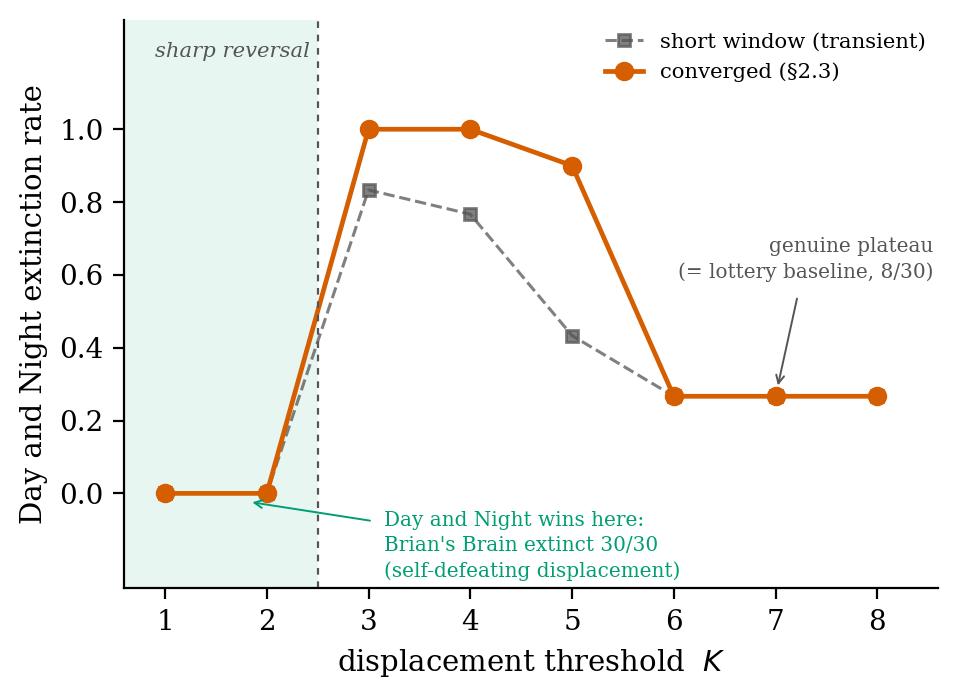
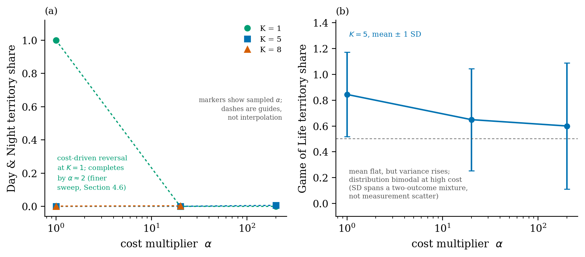
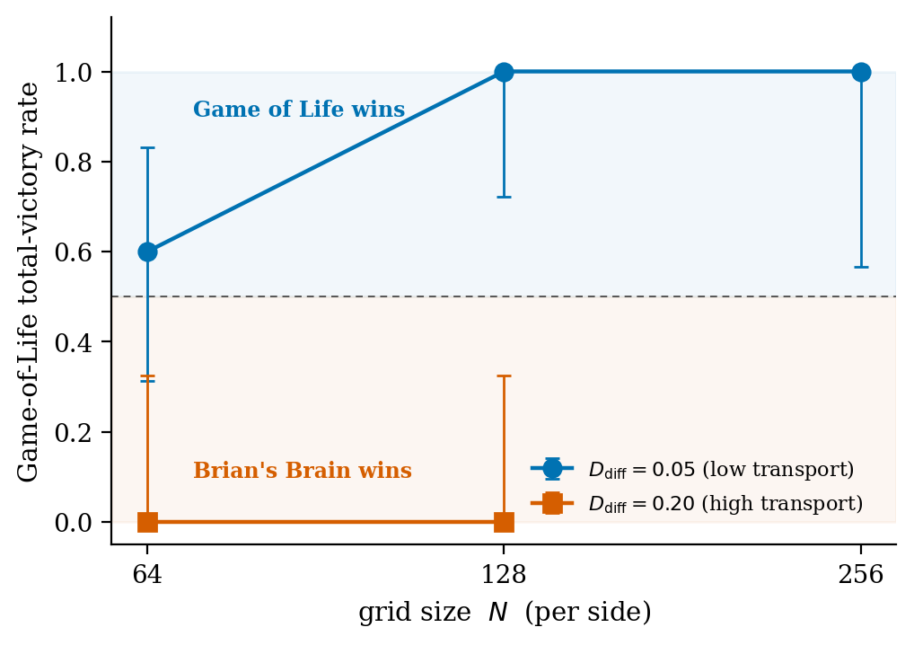

# Dissipative Computation: Energetic Gating of Structure Formation and Competitive Dynamics in Discrete Systems

**D. H. Yoo**

Independent researcher

dennis.yoo@gmail.com

(https://orcid.org/0000-0002-8111-8830)

*Preprint. [Date to be added upon submission.]*

---

## Abstract

Cellular automata are almost always simulated with computation and space effectively free: every transition fires regardless of cost, and populations spread into unlimited room. We give them *skin in the game*, charging each state-changing transition against a local energy budget (a deliberately simplified analogue of Landauer's principle, not a physical `kT ln 2` bound) and letting several automata compete for one finite, diffusing energy field. From this single ingredient, spatial-ecological structure emerges that was never built in. When two automata compete, which one wins is not fixed: it reverses with both the diffusion rate of the energy field and each automaton's metabolic cost, two independent control parameters over the same outcome. The competitive ranking also depends on whether automata can displace one another directly or only claim vacated ground, recovering the classical ecological distinction between displacement and lottery competition. A single pre-existing property of each rule organizes all of this: whether it admits an absorbing state, a configuration in which no cell need change again. The property is fixed by the rule's own definition long before any energy budget is imposed, and it separates the rules that can win from those that cannot.

---

## 1. Introduction

Irreversible computation is never free. Any physical process that erases information does thermodynamic work, made precise by Landauer (1961): erasing one bit dissipates at least `kT ln 2`, regardless of substrate. The bound applies not to computation as such (Bennett (1973) showed any computation can in principle be made logically reversible) but to the *irreversible* operations within it. A cellular automaton's rule application is ordinarily implemented irreversibly, discarding a cell's prior state the moment it updates, and it is this common, rarely-scrutinized irreversibility we take as our starting constraint. We use the principle as a design rule rather than a physical claim: a state-changing transition is charged a fixed cost, a transition that changes nothing is free, and there is no temperature, thermal bath, or heat anywhere in the model. The bound's physical reality is not at issue (it has been directly measured (Bérut et al., 2012)) only its role here.

This paper asks what changes when transitions execute under exactly that constraint. A proposed transition (in a reaction-diffusion system or a cellular automaton alike) executes only if the local energy available at that point in space covers its cost. Energy is supplied either as an independent per-site income or, in the more physically realistic form, as a shared field diffusing between neighbouring sites, so that one region's consumption affects what remains for its neighbours. The gating is applied to four otherwise-standard automata spanning the structural distinction that turns out to matter most (Conway's Game of Life, Brian's Brain, Day and Night, and HighLife) together with a continuous reaction-diffusion system as a non-automaton comparison. This lets us ask which of each rule's qualitative behaviours survive being held to an explicit energetic account, and which depend on the unlimited supply of free transitions implicitly assumed all along.

The new results are organized by one structural criterion: whether a rule admits a configuration requiring no further transition. Three consequences follow.

First, the criterion fixes which side of a sharp boundary a rule's per-cell energetic demand falls on once energy stops constraining it (Section 3.2). Second, the same property (and not directional expansion capacity, as a purpose-built disambiguation confirms (Section 4.4)) is necessary but not sufficient for competitive dominance under a shared depletable resource. It determines which rule occupies the winning side of a transition driven by the diffusion rate of the shared field, the absorbing-state-lacking rule losing at low transport and winning at high (Section 4.1); metabolic cost acts as a second, independent control parameter that can itself reverse the low-transport outcome (Section 4.2). This recovers, rather than newly establishes, both the diffusion-dependent reversal and the classical lottery/displacement distinction from spatial ecology (Section 4.6). Third, the same property lines up with a qualitative difference in neutral drift between identical competitors: one substrate can freeze drift incomplete, the other completes it (Section 4.5).

Two single-rule findings sit alongside these. Structure formation in a reaction-diffusion system requires genuine non-equilibrium driving in a sharp, threshold-like way, whereas a discrete rule's settling under simple attrition does not (Section 3.1). And a same-niche control confirms that two populations of the *identical* rule, distinguished only by a neutral label, exclude one another as competitive exclusion predicts (Gause, 1934), with a between-substrate asymmetry that itself follows from the absorbing-state property (Section 4.5). Code and data supporting all results are publicly available (see Data and Code Availability).

The framework joins two established but largely separate literatures. The first is dissipative structures: sustained non-equilibrium driving lets certain systems organize spontaneously into ordered states (Nicolis & Prigogine, 1977), of which Turing's reaction-diffusion model (1952) is the most influential instance, later parameterized by Gray and Scott (1983, 1984) and mapped by Pearson (1993). The second is cellular automata as models of computation and complex behaviour: Wolfram's four-class classification (1984) and the tradition of rules designed for specific dynamical properties, from Conway's Game of Life to excitable rules such as Brian's Brain (Toffoli & Margolus, 1987), have produced a rich catalogue of discrete systems — almost always studied under the tacit assumption that a proposed transition simply happens. A recurring theme there is that the most life-like behaviour appears at a boundary between frozen order and chaos; one of this paper's findings is that energetic scarcity supplies such a boundary of its own, with structural complexity peaking at each rule's own energetic threshold (Section 3.3).

That assumption is not universal, and three adjacent lines deserve distinguishing. Artificial-life platforms such as Tierra (Ray, 1991) and Avida (Ofria & Wilke, 2004) already treat computation as resource-limited, but the object computed differs in kind (general-purpose programs rather than a fixed local update rule) and their currency governs an organism's reproductive budget rather than gating whether one proposed transition executes. Pomorski and Kotula (2023) apply thermodynamic vocabulary to a stochastic Game of Life with multi-species competition, but treat cell state as a continuous mass with an emergent temperature, transitions always execute, and competition is driven by a tolerance parameter rather than a shared depletable resource. Guha, Ryan, and Karamched (2026) describe a "competitive phase transition" into an "absorbing state" (language paralleling ours) but by an entirely different mechanism, driven by extreme-value first-passage statistics and a non-reciprocal interaction bias, with no energetic gating and no comparison of rule classes by transition-table structure. We take the shared vocabulary as evidence of connection to an active line in mathematical ecology, not a claim of priority over it.

The competitive results also intersect established theory in spatial ecology and interacting-particle systems, and the direction of that relationship matters: none of our automata were designed to reproduce ecological behaviour, and none of the ecological mechanisms are built in. The patterns arise from local energy-gated rules making no reference to ecology; we recognize them after the fact. Two regimes for how contested space changes hands are long established — a *lottery* regime, where an occupant frees territory only through its own attrition (Levins & Culver, 1971; Hastings, 1980), and a *displacement* regime, where a superior competitor takes occupied territory directly (Tilman, 1994) — and Yu and Wilson (2001) showed a hierarchy that coexists under displacement can fail to under a lottery regime alone, the same reversal Section 4.6 finds empirically. We adopt their terminology throughout. The closest published precedent to Section 4.6's mechanism is Martinez-Garcia, López, and Vázquez (2021), who couple a voter-model update (Clifford & Sudbury, 1973) to a competition-colonization trade-off; our contribution within that lineage is narrower — a displacement rule that succeeds only when a local, Landauer-priced budget can afford it, interpolating between the two regimes by energy income rather than a fixed competitive-strength parameter.

One recent study is convergent enough to single out. Vasilyeva et al. (2022) report, for a continuous Lotka–Volterra competition model, that transport rate governs competitive outcome, that spatial structure is essential to the effect, and that distinct survival regimes are separated by parameter thresholds. Our diffusion-driven transition (Section 4.1) reproduces all three, but from a mechanism their model does not contain: the transport rate is that of a *shared, depletable energy budget* rather than of the populations themselves, and competition emerges from energetic gating rather than a Lotka–Volterra coefficient. The agreement is convergent evidence that transport-driven competitive transitions are robust across model classes.

Section 2 develops the Landauer-gated execution framework. Section 3 reports the single-rule findings, Section 4 the multi-rule findings, and Section 5 discusses scope, limits, and the broader implications of treating discrete computation as subject to an explicit energetic account.

---

## 2. Framework and Methods

### 2.1 Landauer-gated execution

The central mechanism used throughout this paper is a modification to how a discrete update rule is applied. In an ordinary cellular automaton, or an ordinary numerical integration of a reaction-diffusion system, a proposed change to a cell's state is simply carried out: the rule is evaluated, and the new state replaces the old one unconditionally. We replace this with a gated version. At each time step, the rule is first evaluated to determine what it *proposes* for every cell, without yet applying it. Any cell whose proposed state differs from its current state constitutes a bit flip in Landauer's sense (an irreversible operation that discards the prior state) and is charged a fixed cost, `FLIP_COST`. A cell whose proposed state matches its current state undergoes no transition and is charged nothing, consistent with Landauer's bound applying only to state changes, not to their absence. A proposed flip is only carried out if the cell's local energy at that moment is at least `FLIP_COST`; otherwise the cell is held at its current state for that step, regardless of what the rule proposed, and no energy is charged. Formally, for cell `i` with neighbourhood `𝒩(i)`, current state `C_i(t)`, and update rule `f`:

$$C_i^{\text{proposed}}(t+1) = f\big(\{C_j(t)\}_{j \in \mathcal{N}(i)}\big)$$

$$\text{Cost}_i(t) = c \cdot \mathbb{1}\left[C_i^{\text{proposed}}(t+1) \neq C_i(t)\right]$$

$$C_i(t+1) = C_i^{\text{proposed}}(t+1) \cdot \mathbb{1}\left[E_i(t) \geq \text{Cost}_i(t)\right] + C_i(t) \cdot \mathbb{1}\left[E_i(t) < \text{Cost}_i(t)\right]$$

where `c` denotes `FLIP_COST`, the fixed per-flip cost defined in Section 2.2, and `𝟙[·]` is the indicator function, equal to 1 if the bracketed condition holds and 0 otherwise.

A word on what this mechanism is and is not, since the name invites a stronger reading than intended. Landauer's principle sets a minimum dissipation of `kT ln 2` for erasing one bit of information in contact with a thermal bath at temperature `T`. The mechanism here is a deliberately simplified analogue of that idea, not an implementation of the bound: `FLIP_COST` is an arbitrary fixed unit, not `kT ln 2`; there is no temperature, no thermal bath, and no explicit information-erasure accounting; and the gate is a phenomenological on/off rule (a transition executes only if the local budget covers its fixed cost) rather than a derived thermodynamic limit. What the mechanism captures faithfully is the structural core of Landauer's insight — that a state-changing, logically irreversible operation must be paid for while leaving a state unchanged is free, and that a substrate unable to afford that payment cannot carry out the operation. We adopt the name "Landauer-gated execution" for this structural correspondence, in the same spirit that established models are named for the idea they abstract rather than for a literal physical claim, and we make no assertion that the model realizes the `kT ln 2` bound or that `FLIP_COST` has physical units. Throughout the paper, "energetic cost," "thermodynamic demand," and related phrases should be read in this analogical sense.

The proposed state (first line) depends only on the current states of cell `i`'s neighbourhood, so the cost (second line) is always computable before the gate is applied, never on the outcome of the gate itself. Figure 1 summarizes the mechanism. This is a materially different mechanism from gating a structure's later *survival* on available energy (as in some of the single-rule results in Section 3.1) — here, energy determines whether the rule's own operation can execute at all.

<figure>
  
  <figcaption><strong>Figure 1. Landauer-gated execution.</strong> Each cell's proposed next state is computed from its neighbourhood by the ordinary rule <em>f</em>; the transition is then charged a fixed cost only if it would change the cell's state, and is executed only if the cell's local energy budget covers that cost. A cell that cannot pay holds its current state rather than failing or resetting. Because the proposed state depends only on the current neighbourhood, the cost is always computable before the gate is applied and never depends on the gate's own outcome (Section 2.1). Energy is supplied under one of the two regimes of Section 2.2 and, in the multi-rule experiments, diffuses through a single field shared by all competitors.</figcaption>
</figure>

### 2.2 Two energy-supply regimes

Two variants of energy supply are used. They are alternatives, not stages: every experiment in this paper runs under one regime or the other, never both, and the regime used is stated with each result. The first isolates the effect of gating alone by preventing cells from competing for energy at all; the second reintroduces competition by making the energy a shared, depletable resource. Broadly, the single-rule results of Section 3 use the first and the multi-rule results of Section 4 the second, with the exception noted below.

**Independent income.** Each cell receives an unconditional quantity of energy, `D`, every time step, regardless of its own state or its neighbours' activity. Energy accumulates across steps (subject to a ceiling, below) and is spent only when a proposed flip is actually carried out. Under this regime, no cell's activity can affect any other cell's energy budget; each site's affordability is independent of the rest of the grid.

**Diffusion-limited shared field.** Each cell instead receives a smaller, uniform background inflow, `D_bg`, and energy additionally moves between neighbouring cells via a discrete Laplacian each step: `E_i(t) ← E_i(t) + D_diff · (mean neighbor energy − E_i(t))`, which exactly conserves total energy on the periodic grid apart from the background inflow term. Under this regime, a region's own consumption measurably depletes what is available to its neighbours, and a resource-rich neighbour can, through diffusion, supply a resource-poor one. This is the substrate used for all multi-rule results (Section 4) and for the diffusion-dependent single-rule results (Section 3.3). All diffusion, income, and gating computations at each step are evaluated from the complete grid state at the start of that step and applied simultaneously (fully vectorized, synchronous update); no cell's affordability determination depends on the order in which other cells happen to be processed, so there is no intra-step resolution-order dependence of the kind that could arise in a sequential, cell-by-cell implementation of the same rules.

**Energy ceiling, and why it must scale with cost.** In both regimes, accumulated energy is capped at a ceiling to bound growth over long runs. Wherever a cost is varied across an experiment, that ceiling is scaled with it, and the warmup duration likewise, since reaching a first affordable transition takes time proportional to cost divided by income rate.

The safeguard matters because the failure it prevents is silent. Updates are synchronous and a cell can execute at most one flip per step, so a ceiling fixed independently of `FLIP_COST` can make a high-cost condition categorically unaffordable no matter how much nominal energy is supplied. The run then returns a result that is bit-for-bit frozen rather than dynamically null, and raises no error doing so. Section 4.2 reports a case caught directly rather than assumed.

### 2.3 Substrates

Two families of dynamical system are tested, in different roles. The cellular automata are the entities whose behaviour and competition this paper is about: they are the rules subjected to Landauer gating, and in Section 4 they are the competitors contending for the shared energy field of Section 2.2. The continuous reaction-diffusion system serves a narrower purpose — it is a non-automaton comparison, used only in Section 3.1 to ask whether the structure-formation behaviour seen under gating is specific to discrete rules or holds for a continuous system as well. It is not the energy field, and it never competes.

The continuous system is the Gray-Scott model (Gray & Scott, 1983, 1984), parameterized following Pearson (1993), in which two chemical species react and diffuse across a two-dimensional field; the gating mechanism applies to the discretized numerical update of the field at each grid point. The discrete family comprises two-dimensional cellular automata on a periodic grid with Moore-neighbourhood (eight-neighbour) rule evaluation, comprising three rule classes chosen for structurally distinct behaviour: Conway's Game of Life (B3/S23 (birth on exactly three live neighbours, survival on two or three); Day and Night (B3678/S34678) a broader, more permissive survival condition); and Brian's Brain, devised by Brian Silverman in 1984 and first described in print by Toffoli and Margolus (1987), a three-state rule (Ready, Firing, Refractory) in which a Firing cell always becomes Refractory and a Refractory cell always becomes Ready regardless of neighbours, so that two of its three states admit no "remain unchanged" option at all. This last property proves decisive in Sections 3 and 4: a rule admitting a configuration in which every cell's proposed next state matches its current state can settle into a static or low-turnover condition that requires no further energy; Brian's Brain cannot.

Unless stated otherwise for a specific experiment, the discrete substrate uses a 64×64 periodic grid, an initial density of 0.25 for single-rule experiments (0.10 per species for multi-rule competition, Section 2.6), and a 200-step warmup before measurement.

### 2.4 The convergence protocol

Every experiment was first measured over a fixed short window (75 to 100 steps past warmup) held constant so that results could be compared across experiments. An audit found that window inadequate wherever a result sits near a transition, because there the reading captures a system still in motion rather than a settled one. In several cases this inverted the reported outcome (Sections 3.3, 4.1, 4.2, 4.6). All affected results were re-measured under the protocol defined here, referred to throughout as the *convergence protocol*.

Its principle is to run each trial until it settles rather than stopping it at a fixed step count. Settling is not detected the same way everywhere, and this is deliberate: which signal is available depends on the rule being measured. A rule that admits an absorbing configuration reaches an exactly fixed population, so an exact-freeze test on its cell count is both available and sharper than any tolerance test. A rule that does not (or one that reaches its absorbing configurations only reluctantly, as Day and Night does) never triggers such a test, and would run to the cap every time. Three detectors are therefore used:

| Detector | Used for | Criterion |
|---|---|---|
| Terminal extinction | all competitive experiments | either species' count reaches exactly zero |
| Frontier freeze + trailing average | pairings where one rule freezes exactly (Sections 4.1–4.2) | the freezing rule's count is unchanged across consecutive checks; the other rule's fluctuating count is then averaged over a 5,000-step window |
| Block-mean stability | pairings where neither rule freezes exactly (Sections 4.3–4.7) | both species' block means agree within a 5% relative tolerance, floored at one cell, across consecutive checks |

For the complexity measure of Section 3.3 the same principle is applied to `C` itself: 10,000-step blocks past warmup, stopping when successive blocks agree to within five percent, capped at 40,000 steps. Which detector applies is itself determined by whether a rule admits an absorbing configuration (Section 5.2).

Unsettled trials at the cap were extended to resolution when few, in the `α ≈ 3` zone of Section 4.2, past 100,000 steps, with each seed's resolution recorded in the banked audit files — classified by drift direction when many, as in the displacement-cost sweeps, and retained in the reported mean with the affected points marked for the complexity profiles of Section 3.3.

Seed counts are stated with each result (30 per point for the main competitive results). Results obtained under this protocol are marked convergence-verified where they appear; the few still resting on the short window are marked provisional. The protocol's own parameters were held fixed rather than swept, which Section 6 returns to as a limitation.

### 2.5 Measuring structure and complexity

Three measurement choices are described here. The first two are quantities: *causal insulation* asks whether a formed structure is genuinely separate from its surroundings, and *structural complexity* is the single number used to compare how much coherent organization a rule sustains at a given energy supply. The third, the *estimator*, is how both are computed from data, and is where the measurement problem of Section 3.3 arises.

**Causal insulation.** To test whether a spontaneously-formed spatial structure is causally distinct from its surroundings, rather than merely visually distinct, we compute time-lagged mutual information between the trajectories of adjacent grid points, classified by position relative to the structure (interior, boundary, or background). Genuine causal insulation predicts higher mutual information between interior points than across the boundary separating a structure from its surroundings.

**Structural complexity.** The same time-lagged mutual information measure, applied without positional classification (simply averaged over randomly sampled neighbouring pairs across the whole grid), is used as a scalar measure of structural complexity for the single-rule diffusion results in Section 3.3. This measure was chosen deliberately over Lempel-Ziv or Kolmogorov-style complexity: those measures increase monotonically with randomness, assigning maximal complexity to pure noise, and cannot distinguish genuine coherent structure from incoherent activity. Mutual information between neighbours is low for a frozen, unchanging grid (no variance to be informative about) and low for genuinely independent, incoherent activity (neighbours do not predict one another), rising only where real, spatially-coordinated structure is present.

**Estimator.** Mutual information is not measured directly; it is estimated from a finite sample of observed states, and the choice of estimator turns out to matter. Two are used, one per substrate. For the discrete automata (all mutual information reported in Sections 3.2–4.6) states are categorical by construction, so the estimator is an exact plug-in frequency count over the small state alphabet, with no binning introduced. For the continuous Gray-Scott substrate (Section 3.1), values must first be grouped, and a ten-bin histogram is used over the pooled range of the two trajectories compared. Both are corrected empirically rather than analytically. Plug-in estimators of mutual information are biased *upward* at small sample size (they report structure where there is none) so affected values are re-measured over long windows, where the bias shrinks toward zero. Section 3.3 quantifies the bias and shows why an analytic correction was rejected.

### 2.6 Multi-rule competition

For the direct competition results in Section 4, two rule classes occupy a single grid simultaneously, each cell holding at most one species' state at a time (or none). Three design choices govern how the two species interact, all held fixed across every pairing tested.

**Mutual blindness.** Each species' survival and birth eligibility is computed counting only same-species neighbours; neither rule can perceive or respond to the other's presence directly, so the sole channel of interaction between them is the shared, diffusing energy field, not direct topological interference. This is relaxed only for the same-niche controls (Section 4.5), where two populations of the identical rule are, appropriately, mutually aware of one another, since genuine same-niche competitors cannot ignore each other.

**Contested-cell resolution.** An unoccupied cell simultaneously eligible for both species is assigned by an unbiased coin flip rather than by relative neighbour count, since different rules' neighbour-count conventions are not on a comparable scale and any count-based resolution would bake in an arbitrary asymmetry between them.

**Vacancy-only takeover.** A cell may only change species by first returning to the unoccupied state; there is no direct mid-state takeover, so occupied cells cannot be directly contested, only inherited upon vacancy. This is the *lottery contest structure* under which all of Sections 4.1–4.5 operate (the term is from spatial ecology; Section 4.6 introduces its counterpart, displacement competition, and tests whether the results survive it). This property proves to be a significant structural feature of the competition results, discussed at length in Section 5.1.

The same-niche controls (Section 4.5) exist to separate two things the competition results otherwise confound. When two *different* rules compete, any outcome could reflect either a genuine difference between the rules or the ordinary dynamics of two populations sharing one finite space. Running a rule against *itself*, with the populations differing in no way that any transition can act on, removes the first possibility and leaves only the second, giving a baseline for what competition does when there is nothing to compete on. For these controls, two populations of one rule are distinguished only by an inert, heritable, two-valued tag with no effect on any transition rule. At each birth or ignition event, the new cell's tag is resolved by an unbiased proportional draw from its active parent neighbours' tags — a neutral genetic-drift model with no fitness differential built in anywhere in the mechanism.

---

## 3. Single-Rule Findings

### 3.1 Structure formation requires genuine dissipative flux; attractor selection under attrition does not

We first tested whether the Landauer-gated framework recovers a known requirement of reaction-diffusion systems: that spontaneous structure formation needs sustained non-equilibrium driving, not merely fluctuations. In the Gray-Scott model, removing the continuous energy input that holds the system away from equilibrium (while leaving the reaction and diffusion terms unchanged) abolished structure entirely rather than merely weakening it. The difference was essentially deterministic across 15 seeds (paired *t* = 769.5, df = 14, *p* ≈ 10⁻³³). A finer sweep of the driving strength showed the transition is not a single sharp threshold but a narrow high-sensitivity band: below it every trial stayed quiet, above it every trial organized, and inside a small intermediate window individual outcomes varied continuously — the signature of a critical transition rather than measurement noise.

The same ignition-and-insulation method applied to Conway's Game of Life produced an analogous threshold and a clear causal-insulation effect: a genuine information-theoretic distinction between a structure's interior and its boundary. The distinction was unanimous across every trial that retained dynamic activity after settling (8 of 8 qualifying seeds), showing the phenomenon is not specific to the continuous substrate.

(This comparison uses a 10-bin mutual-information estimator on 200-step trajectories. Because the result is a differential interior-versus-boundary contrast rather than an absolute magnitude, it is less sensitive to the finite-sample bias discussed in Section 3.3; it has not, however, been re-checked under the long-window protocol.)

We then asked whether the same requirement holds for a different phenomenon: a discrete population's drift toward a small set of persistent configurations under simple attrition, with no fitness function or filtering rule imposed. It does not. A population evolving under Game of Life's rule at zero energetic cost still drifted to the same high-persistence configurations found under an explicit cost, reaching a comparable final state (mean persistence-confidence 0.643 versus 0.657) at a larger population size (77.0 versus 15.3), arriving more slowly, but arriving. Driving is not required here; it sharpens. A sweep of intermediate costs found even that sharpening is threshold-like rather than continuous: three consecutive cost levels (0.00, 0.01, 0.02) produced bit-for-bit identical trajectories, verified to reflect genuinely different underlying energy values rather than a computational artifact, with the full effect appearing only once cost crossed a threshold between 0.02 and 0.04.

The two are therefore not interchangeable instances of a single "self-organization" phenomenon. Structure formation requires genuine dissipative flux outright; attractor selection under attrition does not, though flux accelerates and sharpens it once present.

### 3.2 Per-cell energetic demand depends on whether a rule admits an absorbing state

We next applied Landauer-gated execution (energy determining whether a proposed transition can occur at all, not merely whether its result survives) across the three cellular automaton rule classes described in Section 2.3, sweeping the independent per-cell energy income `D` (the first supply regime of Section 2.2, in which each cell is funded on its own and no cell's activity affects any other's budget) and measuring **demand per active cell**: realized flux divided by the fraction of cells in a non-quiescent state.

Two choices make the comparison meaningful. Demand is measured per active cell rather than as total flux, because total flux falls when a population shrinks — which says nothing about whether the surviving cells are free to rest. And it is compared at the *unthrottled ceiling*, `D = 1.0`, where no proposed transition is refused for want of energy, because under throttling every rule's demand is depressed regardless of class.

Measured there, five rules separate sharply at 1.0. Two of them (Seeds and Life without Death) appear nowhere else in this paper and were classified by inspection of their transition tables, with the prediction recorded, before being measured:

| Rule | Admits an absorbing configuration? | Per-cell demand |
|---|---|---|
| Life without Death (`B3/S012345678`) | yes — every live cell survives, so its proposed state is its current one | 0.000 |
| Game of Life (`B3/S23`) | yes, still lifes | 0.456 |
| Day and Night (`B3678/S34678`) | yes, but reached less readily | 0.837 |
| Brian's Brain | no — firing must become refractory, refractory must become ready | 1.501 |
| Seeds (`B2/S`) | no — nothing survives, so no live cell can hold its state | 2.000 |

Both out-of-sample rules landed on the predicted side, at the extremes of the range, and the boundary between the two groups is structural. A rule whose cells cannot hold their state must average at least one transition per active cell per step once energy stops constraining it; a rule whose cells may rest cannot be pushed above that, and falls as far below as its absorbing configurations allow — to exactly zero for Life without Death, which freezes completely and then costs nothing. Which side of 1.0 a rule falls on is therefore readable from its transition table before any simulation is run.

Two cautions. These are ceiling values, not supply-independent constants (Seeds reads 0.195 at `D = 0.05`, where 85% of its transitions are denied) so throttled measurements compare only against equally throttled ones. And the three absorbing-state rules spread across the range below 1.0 rather than clustering, apparently in order of how readily each reaches its absorbing configuration, which suggests the criterion may have a graded form (Section 6).

Three further observations from the supply sweep:

- Brian's Brain has a hard extinction threshold between `D = 0.25` and `D = 0.3`, below which every measured quantity is exactly zero.
- `D = 1.0` is where the synchronous-update accounting guarantees no cell can be throttled; extending the sweep to `D = 8.0` left every measured quantity unchanged.
- Where the gate binds, the constraint changes character rather than degree. At `D = 0.05`, with 80% of Game of Life's transitions denied, flux is stable from the short window out to 10,000 steps (0.0545, 0.0504, 0.0501) and the active fraction *rises* — gating prevents the rule from reaching an absorbing configuration at all.
- Across the sustained range Brian's Brain's complexity per unit flux (`C/Φ`) runs substantially higher than either absorbing-state rule's settled value, roughly 0.85–1.9 against 0.4–0.5 for Game of Life. The contrast survives correction for the estimator bias of Section 3.3, though the magnitudes are approximate (Appendix A).

**A note on terminology.** "Absorbing state" is used in this paper in a narrower sense than in non-equilibrium statistical physics. There it denotes a configuration a stochastic system cannot leave once entered, and is central to the directed-percolation and related universality classes governing genuine phase transitions between active and absorbing phases (Hinrichsen, 2000). This paper makes no claim about universality class or critical scaling, and the property used here is structural rather than dynamical — a fact about the rule's transition table, checked once by inspection, not a state a trajectory enters.

### 3.3 Complexity is maximized near each rule's energetic threshold and decays with diffusion, across all three rule classes

Extending Landauer-gated execution to the diffusion-limited shared field (Section 2.2), we measured structural complexity `C` (the positional-classification-free mutual-information measure of Section 2.5) as a function of diffusion rate `D_diff` for each of the three rule classes, each evaluated at its own calibrated energetic threshold. One methodological finding governs how these numbers must be read, and is given first.

**A finite-sample estimation bias governs short-window complexity measurements.** Short-window estimates of `C` are dominated by an `O(1/N)` upward bias in the plug-in mutual-information estimator. On pure noise, where the true value is exactly zero, the estimator returns `C ≈ 0.080` at `N = 75` (comparable to some real-signal values in this paper) falling to `0.003` at `N = 500`, `0.0006` at `N = 5,000`, and reaching zero only near `N ≈ 40,000`. Every complexity value below was therefore obtained under the adaptive long-window protocol of Section 2.4: 10,000-step blocks past warmup, a 5% relative stopping tolerance, and a 40,000-step cap. An analytic correction would not have served, because the bias is not a constant offset: activity and therefore joint-symbol diversity differ across diffusion regimes, so the inflation is itself a function of `D_diff` (Appendix A).

**The debiased result is a single shape shared by all three rule classes: complexity peaks at or near each rule's own threshold and decays as diffusion increases (Figure 2).** For Brian's Brain (background inflow at its own threshold), `C` rises from zero below the extinction threshold to a peak of `0.063 ± 0.002` at `D_diff = 0.05`, then falls sharply (`0.017` at `D_diff = 0.10`, `0.006` at `D_diff = 0.20`) before a slight rise across the high-diffusion tail to `0.018` at `D_diff = 1.0`. Game of Life (at its own, much lower threshold) shows the same qualitative profile: highest at the lowest active rate tested (`0.086` at `D_diff = 0.01`), declining through `0.041` and `0.019` to a flat tail near `0.015–0.019`. Day and Night shows it most sharply of all: `0.474` at `D_diff = 0.01` collapsing roughly eight-fold to `0.059` by `D_diff = 0.05`, then flattening to the same low tail (`0.011–0.028`) as the other two. Two features are common to every rule: the maximum sits at the lowest active diffusion rate (each rule's own threshold edge) rather than at an interior value, and a shallow secondary rise appears across the high-diffusion tail in all three.

<figure>
  
  <figcaption><strong>Figure 2. Debiased complexity peaks near each rule's energetic threshold, then declines.</strong> Structural complexity <em>C</em> versus diffusion rate for all three rule classes, re-measured under the long-window protocol that removes the finite-sample mutual-information estimator bias (Section 3.3). Left: linear scale (Day &amp; Night's threshold value dominates the ordinate). Right: log scale, revealing the peak-then-decline shape shared by all three rules; a small horizontal offset separates the three series where their points coincide. Error bars denote ±1 SD; open rings mark points where ≥40% of seeds had not fully met the adaptive convergence criterion at the step cap.</figcaption>
</figure>

The peak's location matters for interpretation. In excitable media, sustaining coherent traveling structure depends on an *intermediate* rate of diffusive transport (Zaikin & Zhabotinsky, 1970; Winfree, 1972). A threshold-anchored maximum does not match that signature, and no such reading is offered here — the `D_diff`-dependence of the bias is what had displaced the apparent maximum away from the threshold edge in the first place.

What the result establishes is the *unifying* observation: the same complexity-versus-diffusion profile appears in all three structurally distinct rule classes, differing in magnitude but not in kind. The phenomenon is a property of diffusion-limited energetic scarcity common to every rule tested, not specific to any one of them. Whether it extends beyond these three classes is untested, as is whether the shared shape reflects one common mechanism or a coincidence of three different ones, no mechanism is proposed here.

Most debiased points retain seeds unsettled at the 40,000-step cap — 16 of the 18 points across the three rules, at rates from 1 to 7 seeds of 10. These are retained in the reported means rather than excluded, and the points where at least 40% of seeds were unsettled are marked with open rings in Figure 2 (10 of 18). A drift-direction diagnostic on the worst-affected point (Game of Life at `D_diff = 0.05`, 7 of 10 seeds unsettled) found mixed drift signs (five positive, two negative, none flat) with tightly clustered block values, indicating sampling noise against a demanding 5% stopping criterion rather than unresolved dynamics. That contrasts with the `α ≈ 3` zone of Section 4.2, where unsettled trials drifted consistently one way and did require extension to resolve. The diagnostic was not repeated at every affected point, so the magnitudes here are robust in shape but approximate in exact value; the per-point counts are given in Appendix A.

## 4. Multi-Rule Findings

### 4.1 Competitive dominance is governed by a diffusion-driven regime transition, not by energetic efficiency

We placed two rule classes in direct competition for a single diffusion-limited energy field (Section 2.6), predicting that Game of Life, as the lower-maintenance rule, would starve Brian's Brain's higher-maintenance cycling by depleting shared ambient energy. The outcome was neither that nor a simple reversal of it, but a transition between two opposite results governed by the diffusion rate of the shared field itself.

At a background inflow giving both species room to activate (`D_bg = 0.05`, 30 seeds per point), the long-run picture is a sharp regime transition (Figure 3). At low diffusion rates Game of Life wins outright in the large majority of trials, driving Brian's Brain to complete extinction in 73% of trials at `D_diff = 0.01`, 83% at `0.03`, 73% at `0.05`, and 76% at `0.07`. Between `D_diff ≈ 0.08` and `0.12` the outcome crosses over (60%, 53%, 43%, then 13% Game-of-Life victory) and by `D_diff ≥ 0.15` it has fully inverted: Brian's Brain wins every trial, leaving Game of Life a small suppressed remnant (mean share 0.03).

  
  <figcaption><strong>Figure 3. Diffusion-driven competitive transition.</strong> Game of Life vs. Brian's Brain under Landauer-gated lottery competition (<em>D</em>bg = 0.05, 30 seeds per point). Game of Life wins outright at low diffusion rates; the outcome crosses over near <em>D</em>diff ≈ 0.08–0.12 and fully inverts to Brian's Brain by <em>D</em>diff ≳ 0.15. Error bars denote Wilson score 95% confidence intervals on the total-victory rate.</figcaption>

The transition is present at the second calibration too, and sharper. Repeating the comparison at a background inflow set to Game of Life's own much lower threshold (`D_bg = 0.01`) (the condition under which the starvation hypothesis predicted Game of Life's advantage should be strongest) gives Game of Life 56% of trials at `D_diff = 0.01`, 13% at `0.02`, and none by `0.03`, where Brian's Brain wins every trial. The two calibrations do not disagree: each samples a different side of the same transition, the first straddling its crossover and the second sitting past it.

That this transition is driven by the transport rate of a shared *energy* field, and separates a regime in which the absorbing-state-lacking rule loses from one in which it wins, is the central competitive finding of this paper. Section 5.2 develops what governs which rule occupies the winning side.

The transition's *existence* is not itself novel. That a transport or dispersal rate can reverse a competitive outcome, with threshold-separated survival regimes, is established in spatial ecology, most directly by Vasilyeva et al. (2022) for continuous Lotka–Volterra competition. The correspondence is close enough to state point by point:

| Reported by Vasilyeva et al. (2022) | Found here |
|---|---|
| Transport rate governs which competitor prevails | Diffusion rate of the shared field reverses the winner |
| Spatial structure is essential to the effect | Effect vanishes without a spatially resolved field |
| Survival regimes separated by parameter thresholds | Crossover confined to `D_diff ≈ 0.08–0.12` |
| What transports: the competing populations | What transports: a shared, depletable energy budget |
| Competition enters via a Lotka–Volterra coefficient | Competition emerges from Landauer-priced gating |

The first three rows are agreement; the last two are the difference. We reached the transition independently and read the agreement as convergent support across model classes, not as precedent. The novel element is the transition's origin in a thermodynamic budget rather than an ecological coefficient.

**Within the regime where Brian's Brain wins, the mechanism is a refuge effect.** Compression into a small territorial footprint reduces intra-species competition among the surviving Game-of-Life cells, leaving them in a resource-rich pocket: mean energy among Game-of-Life-occupied cells is *higher* when competing against Brian's Brain than when Game of Life holds the grid alone (1.28 versus 0.78 at `D_diff = 0.01`). The refuge is a consequence of reduced competition inside a compressed niche, not of exploitation by the competitor that caused the compression — boundary flux does run from the Game-of-Life side toward the Brian's-Brain side, but the energy gradient runs the wrong way for depletion to be the cause. Based on one direct comparison; not an independent measure of intra-specific competition (Section 6).

Two conditions attach to the hierarchy built on this result in Sections 4.2–4.3. "Expansion capacity" is not yet separated from the absence of an absorbing state — Brian's Brain has both, and Section 4.4 tests them apart. And the hierarchy assumes a lottery contest structure, in which territory is lost only through a rule's own dynamics and never taken directly; Section 4.6 tests that assumption and finds it does not hold in general. The transition itself is robust to grid size, present and in the same direction at `N` = 64, 128, and 256, with the low-diffusion Game-of-Life victory sharpening at larger sizes (Section 6).

### 4.2 Metabolic cost drives a second transition that reverses the low-diffusion outcome

Section 4.1 establishes that at the diffusion rate examined here (`D_diff = 0.05`), Game of Life, not Brian's Brain, wins under symmetric metabolic cost. That makes the cost question a sharp one: does asymmetric cost *change which rule wins*? We tested this directly, charging Brian's Brain `α × FLIP_COST` for all three of its transitions while Game of Life paid the unmodified baseline, sweeping `α` from 1 to 200. The energy ceiling and the warmup are both scaled with cost (§2.2, Appendix A); held fixed, the high-`α` conditions freeze outright.

Increasing Brian's Brain's own metabolic cost progressively *rescues* it, driving a second transition (orthogonal to the diffusion-driven one) that flips the low-diffusion outcome from Game-of-Life victory to Brian's-Brain victory (Figure 4). At `α = 1` Game of Life wins, driving Brian's Brain extinct in 73% of trials. At `α = 2` the position is marginally stronger still for Game of Life (86% of trials, the peak of the victory curve). The reversal then sets in sharply: by `α = 10` the outcome has completely inverted (Brian's Brain wins every trial) and this holds stably through `α = 20` and out to `α = 200`, a two-hundred-fold cost with no further tipping point. The transition between the regimes sits near `α = 3`, where 40% of trials end in Game-of-Life victory.

<figure>
  
  <figcaption><strong>Figure 4. Metabolic cost drives a second transition that rescues Brian's Brain.</strong> Game-of-Life total-victory rate versus the multiplier <em>α</em> applied to Brian's Brain's per-transition cost (<em>D</em>bg = 0.05, <em>D</em>diff = 0.05). Game of Life wins at low cost; increasing <em>α</em> past a critical value near <em>α</em> ≈ 3–10 reverses the outcome to Brian's Brain and holds stably to <em>α</em> = 200. The transition near <em>α</em> = 3 exhibits critical slowing down and was resolved by drift-direction classification. Error bars denote Wilson score 95% confidence intervals.</figcaption>
</figure>

That a rule is helped by being charged more for its own transitions is counterintuitive, and we offer the mechanism as a hypothesis rather than an established account: pricing Brian's Brain's mandatory cycling more heavily slows its consumption of the shared field, which appears to reduce the early-game stochastic extinction risk that costs it most low-diffusion trials at `α = 1`, giving its self-sustaining wave dynamics time to establish before the competition is decided. On this reading, cost does not aid Brian's Brain by strengthening it directly but by throttling the activity that otherwise exhausts its local resource before it can consolidate. Metabolic cost is therefore a second control parameter which, like the diffusion rate, selects which rule wins.

Near `α ≈ 3` equilibration times become long — up to `10^5` steps, an order of magnitude beyond the rest of the sweep. Trials still undecided at the protocol cap were extended individually until they resolved rather than classified at the cap (2.4): at `α = 3`, six seeds unsettled at 40,000 steps all resolved to Game-of-Life takeover when run past 100,000, one of them from an apparent share of 0.094 to 0.999. Each is recorded in the banked audit files. Lengthening equilibration near a competitive threshold is not itself new: Vasilyeva et al. (2022) report the same in a continuous Lotka–Volterra spatial competition model, where time to equilibrium is longest when the diffusion parameters sit on a boundary between survival regimes. What the discrete, energy-gated setting adds is severity — here the slowing is pronounced enough to invert the apparent winner, not merely delay the reading.

### 4.3 A second and third pairing complete a regime-dependent competitive ranking

To test whether Section 4.1's result generalizes beyond one pairing, or depends on Game of Life's specific combination of properties (no expansion capacity, low internal turnover), we introduced Day and Night — a rule that, unlike Game of Life, sustains substantial internal activity in its settled state (a small, persistently oscillating population, near-100% turnover among survivors) without expanding into new territory. The contrast against Game of Life is sharp: at `D_diff = 0.05`, Game of Life defeats Brian's Brain (Section 4.1), whereas Day and Night, pitted against Brian's Brain under the identical mechanism, loses decisively, mean territory share 0.4% against Brian's Brain's 99.6%, with Day and Night driven to full extinction in 27% of trials (convergence-verified, 30 seeds), an outcome Game of Life never showed against Brian's Brain at this condition. How this pairing behaves once metabolic cost and direct displacement are introduced is taken up with the cost results (Section 4.7), where it produces the sharpest cost-driven reversal found anywhere in this paper.

This result is ambiguous on its own: Day and Night's loss against Brian's Brain could reflect a genuine cost of lacking expansion capacity, or could simply reflect an independent fragility under energetic scarcity that follows from Day and Night's own settled behaviour — the small, persistently oscillating, near-fully-turning-over population noted above, which never reaches the kind of low-turnover quiescent configuration Game of Life reliably settles into even without any competitor present. A third pairing separates these explanations directly: Game of Life against Day and Night, with Brian's Brain absent entirely, and neither competitor an expansionist. Game of Life defeated Day and Night decisively, mean territory share 0.99, with Day and Night driven to full extinction in 10% of trials (convergence-verified, 30 seeds). Since Game of Life has no expansion mechanism of its own, its advantage here must derive from that same difference in settled behaviour — Game of Life's ability to hold ground in a low-turnover configuration that Day and Night's continual internal cycling denies it — rather than from any capacity to contest territory that Day and Night specifically lacks against directional invaders.

Taken together, the three pairings establish a competitive ranking that is transitive at the diffusion rate where all three were measured. At `D_diff = 0.05` the ordering is Game of Life > Brian's Brain > Day and Night: Game of Life defeats Brian's Brain (Section 4.1) and Day and Night (above), and Brian's Brain defeats Day and Night (above). Every leg was measured at the same condition, so the ordering is fully measured rather than stitched across mismatched conditions.

Its top two positions are not fixed. The Game-of-Life-over-Brian's-Brain result inverts with diffusion rate, so that by `D_diff ≥ 0.15` Brian's Brain defeats Game of Life outright (Section 4.1). Whether the *full* three-way ordering rearranges at high diffusion was not measured: the two Day-and-Night pairings were run only at `D_diff = 0.05`, so Day and Night's high-diffusion ranking is an explicit boundary of what we measured (Section 6).

**Table 1.** Competitive outcomes across all three pairings tested, under the lottery contest structure of Sections 4.1–4.3. All three pairings were measured at a common condition (`D_bg = 0.05`, `D_diff = 0.05`), under which the ranking is transitive: Game of Life > Brian's Brain > Day and Night. The Brian's Brain vs. Game of Life outcome additionally inverts with diffusion rate (Section 4.1); the other two pairings were not re-measured across diffusion rates, so their behaviour away from `D_diff = 0.05` is a stated open boundary (Section 6). Shares are convergence-verified (30 seeds per point). See Section 4.6 for how these pairings behave once occupied territory becomes directly capturable (displacement competition).

| Pairing | Outcome at `D_diff = 0.05` | High-diffusion outcome (`D_diff ≥ 0.15`) | Primary mechanism |
|---|---|---|---|
| Brian's Brain vs. Game of Life | Game of Life wins; Brian's Brain driven extinct in 73% of trials (mean Game-of-Life share 0.74) | Inverts: Brian's Brain wins every trial (mean Game-of-Life share 0.03) | Diffusion-driven regime transition (Section 4.1); absorbing-state absence governs the high-diffusion winner (Section 4.4) |
| Brian's Brain vs. Day and Night | Brian's Brain wins; Day and Night driven extinct in 27% of trials (mean Day-and-Night share 0.004) | Not measured (open boundary, Section 6) | Absence of an absorbing state + Day and Night's settled fragility |
| Game of Life vs. Day and Night | Game of Life wins; Day and Night driven extinct in 10% of trials (mean Game-of-Life share 0.99) | Not measured (open boundary, Section 6) | Day and Night's settled fragility under scarcity |

*The Brian's Brain vs. Game of Life outcome is reported at convergence (Section 4.1).*

Two distinct mechanisms produce the ranking's two steps, and Section 4.4 separates them. The Game-of-Life/Brian's-Brain step, and its inversion with diffusion, is at this stage consistent with either Brian's Brain's capacity for continuous territorial expansion or its lack of an absorbing state, properties it possesses simultaneously. Section 4.4 disambiguates them and finds absorbing-state absence operative; Section 5.2 develops why that property governs the *high-diffusion* winner specifically. The Game-of-Life-over-Day-and-Night step follows instead from a more basic difference in settled behaviour under scarcity: Game of Life can hold ground in a low-turnover quiescent configuration, while Day and Night cycles continually.

### 4.4 A disambiguating pairing tests expansion capacity against absorbing-state absence

Section 4.1's finding was stated as a discovery about directional expansion capacity. Section 3.2's independently-derived criterion is the absence of an absorbing state. Brian's Brain cannot separate these two properties: it lacks an absorbing state and possesses genuine directional expansion at once, so every result in Sections 4.1–4.3 is consistent with either explanation, and the two sections have, to this point, quietly offered different accounts of the same phenomenon.

HighLife (rule B36/S23, devised by Nathan Thompson in 1994) breaks the confound. It shares Game of Life's exact survival condition, so every still-life, oscillator, and glider that exists in Game of Life exists identically in HighLife, it retains the same absorbing states. Its additional birth condition, however, supports a well-documented, genuine self-replicator: a small pattern that copies itself indefinitely along a diagonal line, a directional expansion capacity that plain Game of Life structurally lacks. If expansion capacity alone were the driver of Section 4.1's result, HighLife should dominate Game of Life in something resembling the manner Brian's Brain did. If the absorbing-state property is the true driver, HighLife's expansion capacity should not be enough.

Whether this test is meaningful depends on HighLife's extra birth condition actually being exercised during competition, not merely available in principle — a dense, energy-gated, competitive environment could in principle suppress it entirely, in which case the pairing would reduce to two rules with identical survival conditions producing an uninformative tie. This was checked directly rather than assumed. Births occurring specifically via HighLife's six-neighbour condition (categorically impossible under Game of Life's rule) were counted separately from ordinary three-neighbour births throughout every run. Under lottery competition, this mechanism fired substantially and at an accelerating rate in every one of the 15 seeds tested (mean 1,085 such births during the 100-step measurement window alone; minimum 278, confirming the effect in the least favourable seed as well as the mean). Under displacement competition, the same mechanism remained active across the full range of capture thresholds tested, from several dozen events per window at the most restrictive threshold to over a thousand at moderate and permissive thresholds. HighLife's expansion capacity was genuinely and continuously exercised throughout every condition reported below, not merely available.

Pitted against Game of Life under the identical lottery-competition mechanism used throughout Sections 4.1–4.3, HighLife showed neither the total dominance nor the total collapse that Brian's Brain produces against every rule it beats. The precise character of the outcome required correction, however.  Re-run to convergence (30 seeds), the true outcome is not a stable near-parity but a wide, effectively multi-modal distribution: Game of Life takes the large majority of the grid (share above 0.9) in 26 of 30 trials, a genuine middling coexistence (share ≈ 0.34–0.36, individually verified stable) in 2, and HighLife takes the large majority (share below 0.02) in the remaining 2 (Figure 5). Extinction-like outcomes are, in other words, the norm rather than the exception — but crucially, they fall on *both* sides and average out to no systematic winner, which is qualitatively different from Brian's Brain's near-deterministic, one-sided extinction of every competitor. Under displacement competition (Section 4.6's mechanism), the pairing again showed no sharp transition and no systematic winner across the full range of capture thresholds tested — the same absence of the decisive, one-directional dominance that every Brian's-Brain pairing exhibits.

<figure>
  
  <figcaption><strong>Figure 5. The absorbing-state criterion, not expansion capacity, governs dominance.</strong> Outcome distribution for Game of Life vs. HighLife under lottery competition (30 seeds, <em>D</em>bg = 0.05, <em>D</em>diff = 0.05). HighLife shares Game of Life's directional expansion capacity (via its B6 rule) but retains an absorbing state. No seed ends in either side's total extinction, and the outcomes that do occur fall on both sides, in contrast to the near-deterministic one-sided dominance Brian's Brain (which admits no absorbing state) achieves against the same opponent (Section 4.4).</figcaption>
</figure>

This is best read as a falsification test rather than a clean mechanistic dissociation, and the distinction matters. The test was: if directional expansion capacity alone were sufficient for Section 4.1's result, HighLife (which has a genuine self-replicator) should dominate Game of Life in something like the way Brian's Brain does. It does not: because HighLife shares Game of Life's absorbing states, it can also settle into quiescence, and does so often enough that its outcomes against Game of Life scatter across both extremes and the middle rather than concentrating into the one-sided, near-deterministic exclusion Brian's Brain produces. Expansion capacity, exercised continuously (as the six-neighbour birth count above confirms), is thus present in a rule that conspicuously fails to dominate. This falsifies "expansion capacity is sufficient" and is consistent with absorbing-state absence being the operative property, but it rests on a single additional rule and does not, on its own, isolate the mechanism against every alternative: HighLife differs from Brian's Brain in more than one way (its density, its overlap with Game of Life's survival rule, its ignition statistics), and a stronger dissociation would require several rules varying expansion capacity and absorbing-state structure independently (Section 6). With that caveat stated, the result supports reading Sections 4.1–4.3's "expansion capacity" framing and Section 3.2's absorbing-state criterion as connected rather than independent (with absorbing-state absence the better-supported driver) and "expansion capacity" as used earlier in this section is accordingly better read as shorthand for that property.

### 4.5 Same-niche controls confirm the invariant is a genuine consequence of rule differences

Because Sections 4.1–4.4 test competitors occupying different ecological niches, none of them directly test the classical competitive exclusion principle (Gause, 1934), which predicts exclusion specifically between identical-niche competitors, nor do they rule out the outcome being an artifact of the grid or energy mechanics rather than a genuine consequence of the rules' differing structure. We constructed a direct control: two populations of an identical rule, distinguished only by an inert, heritable tag with no effect on any transition, mutually aware of one another (Section 2.6).

For Game of Life the two conditions tested (unconstrained execution, and energy-gated diffusion at Game of Life's own calibrated threshold) behave differently, and the difference is itself informative. All figures below are measured to 40,000 steps.

Under unconstrained execution, drift does not resolve at all. The population collapses rapidly to a small, low-turnover remnant (107–168 live cells), tag-fraction variance and a local spatial-segregation index rise sharply and then freeze once reproduction effectively ceases, and no seed reaches fixation in 40,000 steps (0 of 6; final tag fractions 0.16–0.50, none approaching either boundary). This is an incomplete drift locked in place rather than a slowly resolving one: once the population settles into configurations requiring no further transition, drift has no mechanism left to act through.

Under energy-gated diffusion the population instead remains large and active throughout (~1,800 cells), and drift *can* resolve — 5 of 12 seeds reach fixation, the earliest at step 12,783. The reason is the single-rule result of Section 3.2: gating prevents Game of Life from reaching an absorbing configuration at all, so births and deaths continue and drift retains something to act through. Scarcity does not merely slow the rule down; it denies it the very configurations that would otherwise freeze its drift.

Rebuilding the identical control for Brian's Brain tested a specific structural prediction: because two of Brian's Brain's three states admit no absorbing configuration, its populations cannot freeze in the way Game of Life's can, so genuine fixation should be directly observable rather than only asymptotically approached. This was confirmed in both conditions. At the same 40,000-step budget, unconstrained execution reaches fixation in 7 of 10 trials, all by step 242, in a small remnant population; energy-gated diffusion reaches fixation in 10 of 10, all by step 5,487, in a large actively-cycling population of roughly 2,200 — a population scale comparable to Game of Life's own gated condition.

Compared at that matched budget, the two rules separate cleanly in both conditions, though in different ways. Unconstrained, the contrast is qualitative: Brian's Brain completes in 7 of 10 trials by step 242 while Game of Life completes in none of 6 by step 40,000. Gated, it is a difference of time scale, but the two ranges do not overlap — every Brian's Brain fixation (latest 5,487) precedes every Game of Life fixation (earliest 12,783), and Brian's Brain completes in every trial where Game of Life completes in fewer than half. A shorter measurement window would have shown Game of Life never completing at all; the separation reported here is the one that survives a window long enough for both rules to finish what they are going to do.

Neither control produces the directional displacement of Sections 4.1–4.4. Both produce only neutral drift, with fixation completed on Brian's Brain and merely approached on Game of Life. That is the result, and it does two things.

It strengthens Sections 4.1–4.4. Applied to genuinely identical competitors, the same substrate mechanics yield drift governed by ordinary population dynamics (consistent with neutral theory's account of ecological drift among functionally equivalent individuals (Hubbell, 2001)) and never a systematic, repeatable advantage for one side. The decisive outcomes reported earlier therefore reflect the rules being compared, not the mechanics comparing them.

It also sharpens the account from Section 3.2. The same organizing principle (identical-niche competitors should not stably coexist) holds on both substrates, but is demonstrated differently on each. On the substrate structurally incapable of an absorbing configuration it is shown directly, through repeated completed fixation events. On the substrate that can settle into one it remains only asymptotically implied, through real but unresolved drift.

### 4.6 The competitive hierarchy does not survive displacement competition

Every result in Sections 4.1–4.5 rests on a lottery contest structure (2.6; Levins & Culver, 1971; Hastings, 1980): an occupied cell can only be lost through its own species' internal dynamics, never directly displaced. We tested whether the hierarchy established above depends on this by introducing direct displacement, in the manner of the voter model (Clifford & Sudbury, 1973): an occupied cell becomes eligible for takeover by the opposing species if at least `K` of its neighbours belong to that species, layered on top of, not replacing, the existing lottery mechanism. Several further design choices proved consequential enough to require explicit, swept treatment rather than an implicit default — principally what a captured cell becomes, and which neighbour states count toward the capture pressure required to take one over, a finding in its own right, discussed below.

The cleanest test involves no rule with multiple internal states: Game of Life against Day and Night, both two-state, at the first calibration. Under lottery competition Game of Life dominates decisively (mean share 0.993). Under displacement the outcome is threshold-dependent and reverses: at `K = 1`–`2`, where capture is easiest, the pairing collapses to near-exact parity (0.501, 0.500); at `K = 3`–`5` Game of Life recovers complete dominance (1.000); by `K = 6`–`8` the outcome has reconverged to the lottery baseline (0.993), capture events having become too rare to matter. A hierarchy that looks fixed under one contest structure is therefore a property of that structure, not of the rules alone.

The flagship pairing, Game of Life against Brian's Brain, shows the same sensitivity in a richer form. Brian's Brain's three states introduce two implementation choices with no canonical resolution (what a captured cell becomes, and which states exert capture pressure) and at low thresholds they are qualitatively decisive, one combination turning total Brian's Brain dominance into complete Brian's Brain extinction. The effect shrinks at moderate thresholds and vanishes at high ones as the system reconverges to the lottery result. The variants and their trajectories are in Appendix B; the main qualitative transitions survive all of them.

A third pairing, Day and Night against Brian's Brain, confirms the sensitivity generalizes, and shows displacement working against the rule that performs it. Under the convention used throughout (Appendix B), a cell Brian's Brain captures is born refractory, and a refractory cell must cycle to vacancy on the following step. Capturing therefore converts occupied ground into empty ground rather than into held territory. At `K ≤ 2`, where capture is easiest and so happens most, this is fully reliable at 30 seeds: Brian's Brain goes completely extinct in every trial. Under the alternative convention, where a captured cell is born firing, the same pairing runs the other way (Appendix B) — the effect belongs to the interaction between the capture rule and Brian's Brain's forced cycle, not to the pairing alone. At `K = 3` and `K = 4` the outcome reverses just as completely, Day and Night going extinct in 30 of 30; `K = 5` is a partial relaxation (27 of 30), and `K = 6` through `K = 8` settle on a plateau of 8 of 30, matching Section 4.3's lottery-competition baseline within sampling noise. The thresholds nearest the reversal are the ones where a short window misreports (2.4): apparent survivors there are trials still in slow decay, and the converged counts are deterministic where the short window suggested partial outcomes. The `K = 6`–`K = 8` plateau matched cell-for-cell at both windows and was never at issue.

The picture for this pairing is therefore a sharp, fully deterministic reversal between `K = 2` and `K = 3` (Day and Night winning completely at `K ≤ 2`, Brian's Brain at `K = 3`–`4`) followed by a separate, gradual relaxation back to the lottery baseline as `K` rises through `K = 5` to the `K = 6` plateau (Figure 6). The qualitative shape matches the other three pairings in this section: a sharp reversal followed by reconvergence to baseline.

<figure>
  
  <figcaption><strong>Figure 6. The lottery-to-displacement reversal.</strong> Displacement <em>K</em>-sweep for Day and Night vs. Brian's Brain (Section 4.6, <em>D</em>bg = 0.05, <em>D</em>diff = 0.05, 30 seeds per point). Plotted is the <em>Day and Night</em> extinction rate at every <em>K</em>: because the reversal is a change in which species is eliminated, a single extinction-rate series would otherwise mix two quantities. The shaded region <em>K</em> &le; 2 marks the regime where Brian's Brain instead goes extinct in 30 of 30 trials, direct displacement being self-defeating for it there. The convergence protocol (2.4, solid) resolves what the short-window reading (dashed) rendered as a gradual rise into a sharp, fully deterministic reversal between <em>K</em> = 2 and <em>K</em> = 3, followed by a separate and genuine relaxation through <em>K</em> = 5 to the <em>K</em> = 6–8 plateau, which matches the lottery-competition baseline (8 of 30) and was confirmed cell-for-cell at both windows.</figcaption>
</figure>

A fourth pairing, Game of Life against HighLife, provides a further confirmation, and a contrast. Section 4.4 found these two rules roughly evenly matched under lottery competition; under displacement competition, across the full range of capture thresholds tested, they remain evenly matched throughout (Game of Life's share bounded between 0.486 and 0.597, no extinctions, no sharp transitions) — none of the dramatic reversals, self-defeating-displacement escapes, or extinctions found in every pairing involving Brian's Brain or Day and Night. Two rules that both admit an absorbing state produce a stable, undramatic contest under both regimes tested; the dramatic sensitivity to displacement-mechanism design found elsewhere in this section is specific to pairings in which at least one competitor lacks that property.

All four pairings were re-run at a second calibration, with inflow set to Game of Life's own much lower threshold (`D_bg = 0.01`, `D_diff = 0.03`), across the full `K = 1`–`8` range. This condition proved the most window-sensitive in the paper — 13 of 16 pairing/`K` combinations changed once the measurement window was extended to 5,000 steps, with no further change at 15,000 — and all figures below are reported at that window.

The transition is sharp and fully deterministic for three of the four pairings, located between `K = 2` and `K = 3` in every case, and each settles by `K = 6`–`8` onto its own directly measured lottery baseline:

| Pairing (share of the first-named rule) | `K = 1`–`2` | `K = 3`–`5` | `K = 6`–`8` | lottery baseline |
|---|---|---|---|---|
| Game of Life vs. Brian's Brain | 0.459, 0.500 | 0.000 | 0.024–0.029 | — |
| Game of Life vs. Day and Night | 0.501, 0.500 | 1.000 | 0.993 | 0.993 (sd 0.004) |
| Day and Night vs. Brian's Brain | 1.000 | 0.000 | 0.0023 | 0.0023 (sd 0.0008) |

Game of Life vs. HighLife again shows no sharp transition at any `K`, but a property absent at the first condition surfaces here: its near-parity outcome is high-variance (sd 0.24–0.27 from `K = 3` onward, 30 seeds) rather than stable (sd 0.14–0.18). An independently measured lottery-only baseline shows the identical variance (0.527, sd 0.256), so this belongs to the pairing rather than to the `K`-sweep.

Background-inflow calibration can therefore change not just the magnitude of a pairing's outcome but its variance structure, turning a stable coexistence into a wide one.

Across all pairings tested, the conclusion is the same: the competitive hierarchy reported in Sections 4.1–4.3 is a property of a specific contest structure — a lottery regime that rewards continuous vacancy-generation and reclamation, recovering a distinction long established in spatial ecology (Yu & Wilson, 2001) — not a general property of "expansion capacity" holding under any form of competition. Whether, and how decisively, a dominant rule's advantage survives genuine displacement competition depends on implementation choices for which no single canonical answer exists, and the shape of that dependence varies with each competitor's own underlying robustness — specifically, with whether that competitor admits an absorbing state (Sections 4.4, 4.6).

### 4.7 Metabolic cost under displacement competition

Section 4.2 established that Brian's Brain's metabolic cost drives a transition in the *lottery*-competition outcome: at the diffusion rate examined, Game of Life wins under symmetric cost, and Brian's Brain wins only once its own cost is raised past a critical value near `α ≈ 3–10`. A natural question is how cost interacts with displacement. This was tested directly, extending the cost-multiplier convention of Section 4.2 to charge the multiplier for any transition involving a Brian's Brain state, including displacement in either direction. All three pairings below are re-run under the convergence protocol (2.4) and are convergence-verified.

The flagship pairing (Game of Life vs. Brian's Brain) was swept across `K = 1, 5, 8` and `α = 1, 20, 200` at 10 seeds per combination, with a finer sweep through `α = 2, 3, 4, 5, 10` at `K = 5` and `K = 8`. All 130 runs converged.

The first result is that this pairing never produces a middling outcome. At every threshold and every cost level tested, each seed resolves to one species holding essentially the entire grid, no run landed between shares of 0.1 and 0.9. The reported means are therefore win rates rather than settled splits, and cost does not change that character. What cost changes is which side wins. At `K = 5`, Game of Life takes the grid in 6 of 10 seeds at `α = 1`, 8 of 10 at `α = 2`, 4 of 10 at `α = 3`, and none at `α = 4` and above; at `K = 8` the same sequence runs 6, 9, 3, 0. The apparent stabilization at high cost (seed-to-seed standard deviation falling from 0.49 to 0.06) is not the contest becoming less of a lottery but the lottery becoming decided.

The second result is that this curve is not specific to displacement. Section 4.2's lottery-competition cost sweep for the same pairing rises from 22 of 30 Game-of-Life victories at `α = 1` to 13 of 15 at `α = 2`, falls to 6 of 15 at `α = 3`, and reaches zero by `α = 10`. The peak location, the crossover near `α = 3`, and the complete collapse all reproduce under displacement, at both thresholds tested. For this pairing the cost-driven transition is invariant to contest structure — worth stating plainly, since the rest of this section documents the opposite. The `α ≈ 3` crossover also falls exactly where Section 4.2 found critical slowing down, corroborating that zone's location from an independent mechanism.

At `K = 1` cost barely moves the outcome (mean Game-of-Life share 0.500, 0.509, 0.593 across `α = 1, 20, 200`), and the `α = 1` result is exact parity with zero variance across all ten seeds.

The same test was extended to the second and fourth pairings (Figure 7), where the lottery-competition behaviour of Section 4.2 generalizes only partially.

For Day and Night against Brian's Brain, cost produces the sharpest reversal in this paper. At `K = 5` and `K = 8` the outcome is effectively unmoved — Brian's Brain already dominates and cost does not change that. At `K = 1`, where Day and Night's escape via Brian's Brain's self-defeating capture (Section 4.6) is complete and deterministic (share 1.000), pricing Brian's Brain's mandatory refractory transition above roughly 1.5–2× baseline reverses the outcome completely and deterministically to 0.000. The escape route survives its own cost only while that cost stays near baseline.

For Game of Life against HighLife the cost convention is necessarily different: HighLife's distinguishing feature is a self-replicator, so the multiplier is applied to its `B6` births. The mean outcome stays near parity across a two-hundred-fold cost increase (0.84, 0.65, 0.60), but the variance rises sharply and the distribution becomes bimodal — individual seeds resolve to near-total victory for one side or the other rather than to intermediate shares. Cost destabilizes this pairing instead of redirecting it, the opposite of its effect on the flagship, where the same intervention decides a lottery rather than opening one.

<figure>
  
  <figcaption><strong>Figure 7. Metabolic cost under displacement competition, for the two convergence-verified pairings.</strong> <em>Left:</em> Day and Night vs. Brian's Brain. At <em>K</em> = 1, pricing Brian's Brain's mandatory refractory transition above roughly 1.5–2× baseline reverses the outcome completely and deterministically (Day-and-Night share 1.0 → 0.0) — the sharpest cost-driven transition in this paper. <em>Right:</em> Game of Life vs. HighLife. Charging HighLife's B6 self-replication leaves the mean outcome near parity but sharply increases variance; at high cost the distribution becomes bimodal (individual seeds resolve to 0 or 1, not intermediate values), so the plotted standard deviation reflects a two-outcome mixture rather than measurement noise. Both pairings re-run under the convergence protocol (2.4). Markers show the sampled cost multipliers (<em>α</em> = 1, 20, 200); dashed segments in the left panel are visual guides, not interpolation, and the <em>K</em> = 1 reversal in fact completes by <em>α</em> ≈ 2 (Section 4.7). The <em>α</em> = 200 points rest on three to five seeds rather than ten, and <em>K</em> = 8 at <em>α</em> = 200 in the left panel was not run.</figcaption>
</figure>

---

## 5. Discussion

### 5.1 Territorial dominance reflects capacity to claim vacancy, not to contest occupancy — and whether it manifests is governed by transport rate, cost, and contest structure

Under the lottery structure of Sections 4.1–4.5, a cell changes hands only once its occupant's own dynamics vacate it. Brian's Brain's advantage is therefore *generative* rather than *displacive*: mandatory cycling continuously creates vacancies it is well placed to reclaim, while Game of Life's settled configurations generate almost none. Whether that proves decisive, or is outweighed by Game of Life's capacity to hold settled ground, is what the transport rate governs — which is why the outcome is a regime transition rather than a fixed ranking.

Two direct tests bear on this account. Section 4.4 separates the two properties Brian's Brain possesses simultaneously and finds expansion capacity insufficient on its own, leaving absorbing-state absence as the operative one. Section 4.6 replaces the lottery structure with genuine displacement (Tilman, 1994; Clifford & Sudbury, 1973), and no ranking survives fully intact once occupied cells become capturable — with which pairings prove sensitive tracking the absorbing-state property rather than the contest structure.

These results narrow the correct reading of Section 4's headline finding. It is not "expansion capacity dominates energetic efficiency" as a general claim, nor a newly-discovered ecological principle, nor a fixed competitive ranking. It is a thermodynamically-gated instance of the lottery-versus-displacement distinction long established in spatial ecology and interacting-particle systems (Levins & Culver, 1971; Hastings, 1980; Tilman, 1994; Clifford & Sudbury, 1973; Yu & Wilson, 2001), organized underneath by a single structural property (§5.2) and governed on top by two control parameters. Absorbing-state absence is what makes a rule *capable* of generative dominance; the transport rate and relative metabolic cost determine whether it manifests as dominance in any given regime, and genuine displacement makes it contingent in a further way still.

### 5.2 A single structural property organizes findings across single-rule energetics, multi-rule competition, and neutral drift — necessary for competitive dominance, though not on its own sufficient

One property organizes results that otherwise appear unrelated: whether a rule admits an absorbing configuration, a state in which every cell's proposed next transition matches its current one and no further energy is needed to maintain it. It accounts for three findings.

In isolation, it explains the qualitatively different per-cell energetic demand of Section 3.2: rules admitting an absorbing configuration fall below one transition per active cell per step, rules lacking one cannot. Between identical competitors, it explains the two same-niche drift regimes of Section 4.5: Game of Life's drift freezes incomplete once its population reaches an absorbing configuration and resolves only where gating prevents it from reaching one, while Brian's Brain's cannot freeze and reliably completes. And in competition, following the direct test of Section 4.4, it determines which rule is capable of decisive dominance once expansion capacity and absorbing-state absence are pulled apart.

The competitive claim needs stating precisely, because the corrected measurements make the property *necessary but not sufficient* rather than equivalent to dominance. Absorbing-state absence is what makes Brian's Brain capable of winning at all (it sustains the generative, vacancy-creating dynamics a rule with an absorbing state cannot) but whether it does win is set by transport regime and relative cost (Sections 4.1–4.2). The property selects which rule occupies the winning side of the diffusion-driven transition; it does not make that rule win unconditionally.

Nor does it explain every step of Section 4's ranking. Game of Life's advantage over Day and Night rests instead on a difference in settled behaviour under scarcity — Game of Life settles into a low-turnover quiescent configuration, while Day and Night's broader survival condition keeps it cycling. Whether that difference reduces to the same underlying property is untested (Section 6).

The property was identified in how a single rule uses energy, and later held in two experiments built around other questions. The neutral-drift control (Section 4.5) concerns a phenomenon with no energetic content at all (drift between competitors differing in nothing a transition can act on) and there Brian's Brain reached fixation in every gated trial and most unconstrained ones, while Game of Life froze without resolving whenever it was free to settle; the two rules' fixation times do not overlap at matched budget. The HighLife disambiguation (Section 4.4) set two rival hypotheses against each other, and the outcome matched the one this property implied. Both were qualitative predictions, insensitive to transport rate and cost, and both could have come out otherwise.

The bifurcation of the measurement protocol is a smaller instance of the same thing: an exact-freeze detector works for a rule that settles into an absorbing configuration and fails for one that does not, so the protocol of Section 2.4 had to split along the very property it was built to study.

### 5.3 Self-organization is not a single phenomenon, and two connections the framework makes testable

Section 3.1's finding — that spontaneous structure formation requires genuine dissipative flux while a population's drift toward persistent configurations under simple attrition does not — argues against treating "self-organization" as a single, uniform phenomenon whenever a discrete or continuous system is observed to organize itself without external design. The two processes examined here differ in a specific, identifiable way: one requires the system to be held away from equilibrium by continuous energetic input; the other is a consequence of the update rule's own dynamics, which will sort a population toward its most robust configurations given enough time regardless of whether that input is present. Systems described informally as "self-organizing" in the broader literature may involve either mechanism, or both, and the distinction is not visible from the end state alone — only from testing, as done here, whether the phenomenon survives the removal of sustained driving.

Two further connections are worth stating as questions rather than claims, because the framework makes them askable and this paper does not answer them.

The first concerns universality. Gated execution produces transitions of a recognizable form: below Brian's Brain's energetic threshold every measured quantity is exactly zero, above it activity is sustained, and the two are separated by a narrow band (Section 3.2). An active phase, an absorbing phase, and a threshold between them are the preconditions for asking whether the transition belongs to the directed-percolation universality class that governs absorbing-state transitions generally (Hinrichsen, 2000). We make no such claim, and the answer is not obvious in either direction: directed percolation is conventionally formulated for stochastic dynamics with a unique absorbing configuration, whereas these rules are deterministic and randomness enters only through initial conditions and the shared field. The question is nonetheless well posed and has a definite test — measuring how the density of active cells scales with distance from the threshold, and comparing the resulting exponent against the directed-percolation value.

The second concerns where complex behaviour sits. Wolfram's classification (1984) separates ordered from chaotic rules, and the most life-like behaviour is generally found near the boundary between them, a boundary located by varying the rule. Section 3.3 finds structural complexity maximized at each rule's own energetic threshold, with the rule held fixed. Energetic scarcity therefore supplies a second control parameter along which a complexity maximum sits at a boundary. Whether the two boundaries are the same boundary reached from different directions, or merely analogous, is untested here; for a rule family parameterized continuously, both could be varied at once and the question settled directly.

## 6. Scope and Limitations

The most consequential limitations concern measurement adequacy. Two failures were identified by the convergence audit (2.4), and both bear on how every quantitative figure in Sections 3 and 4 should be read.

*Slow relaxation.* Near a transition the short window reports a transient as an outcome, and not merely with the wrong magnitude: it inverts the flagship competitive result (Section 4.1) and mislocates the cost transition (Section 4.2). Every result in Sections 4.1–4.6 was obtained under the convergence protocol, with combinations still unconverged at their caps flagged where they occur.

*Estimator bias.* The complexity measure `C` carries an `O(1/N)` positive bias, large enough at the standard window to report structure in pure noise, and it cannot be repaired retroactively, only re-measured (Section 3.3). Section 4's competitive results are population-count based and unaffected. Section 3.2's efficiency ratio `C/Φ` inherits the bias in its numerator and was not re-measured at long window, so its magnitudes remain provisional; a surrogate test shows the bias floor is roughly 2.7 times larger for Brian's Brain than for the two-state rules, and the qualitative contrast survives subtraction of each rule's own floor (Section 3.2; per-rule values in Appendix A). Section 3.1's causal-insulation result uses a different estimator and a differential rather than absolute comparison, which is more robust to the bias, but it too was not re-verified at long window.

**Residual unchecked items.** Every experiment on which a reported claim rests has been checked against this failure mode: the lottery-only baselines of Sections 4.1–4.4 at both calibrations and 30 seeds per condition, Section 3.2's demand measurements under the long-window protocol, and Section 4.5's same-niche controls at a ten-fold longer budget. Two of those checks changed what the paper says — the demand criterion is now stated per active cell at the unthrottled ceiling rather than as total flux, and Game of Life's gated drift does complete in a minority of trials rather than never — and both are reported as revised. Two experiments were not re-checked, and are noted where they appear: Section 3.1's causal-insulation result, which uses the more bias-robust differential estimator, and Section 4.1's refuge comparison, which rests on a single measurement in any case.

**Residual gaps in the displacement experiments.** All three cost-under-displacement pairings are convergence-verified (Section 4.7). Three gaps remain. The `α = 200` points for Day and Night vs. Brian's Brain at `K = 5`/`K = 8` rest on three to five seeds rather than ten; Game of Life vs. HighLife's `K = 3`/`K = 8` variance was not part of the re-run; and for the flagship pairing (complete at 10 seeds with no unconverged trial in 130 runs) `K = 3` was not swept, the grid having been matched to the other two, and the `α = 1` to `α = 2` interval where its win-rate peak sits was not sampled finely.

**Sensitivity to contest structure and conditions.** Section 4.6 demonstrates the competitive results are sensitive to contest structure directly. All pairings were characterized at one background-inflow and diffusion condition, with a second calibration (`D_bg = 0.01`, `D_diff = 0.03`) tested for all four pairings across `K = 1–8`. Replication depth was equalized where it mattered, at 30 seeds — a 10-seed sample had suggested a `K = 2` extinction was universal when it is not. Precedence (displacement overriding a cell's own survival rule) was tested against a coin-flip alternative and found not to matter for the flagship pairing (`p = 0.18`, `p = 0.92`), unlike the capture birth-state and pressure definitions, which are consequential.

**Scope of the disambiguation.** Section 4.4 rests on one pairing. It establishes that expansion capacity alone is not sufficient for Brian's-Brain-style dominance, not that expansion capacity contributes nothing more generally; a rule with genuine expansion capacity but a *harder-to-reach* absorbing state than Game of Life's remains untested and could give an intermediate result.

**A binary criterion that may be graded.** Section 4.3 found Day and Night more fragile under scarcity than Game of Life despite both admitting absorbing states, its broader survival condition keeping it in continual cycling rather than letting it settle. Section 3.2's ceiling measurements point the same way: the three absorbing-state rules do not cluster below 1.0 but spread across it (0.000, 0.456, 0.837), apparently in order of how readily each reaches its absorbing configuration. Whether that ordering is a continuous version of the same property, rather than a separate mechanism, is untested (it would need more rules to establish that the ordering means anything) and would extend Section 5.2's criterion from binary to graded if confirmed.

**Further limits.**

- The competitive hierarchy of Section 4.3 is empirical across the rule classes tested, not a general law.
- The energy ceiling (Section 2.2) belongs to this paper's synchronous-update accounting; whether Brian's Brain's demand continues past that scheme's representational limit under an asynchronous or continuous-time formulation is not addressed.
- The refuge mechanism (Section 4.1) rests on a single direct comparison rather than an independent measurement of competition intensity.
- The debiased complexity profile (Section 3.3) is reported without a mechanistic account.
- The framework is restricted to a two-dimensional, discrete, periodic grid.

**Grid size.** Three results were re-run at `N = 128` and `N = 256` (15 seeds each) alongside the `N = 64` used throughout. The two most consequential reversals were fully robust: 15 of 15 seeds reproduced Brian's Brain's extinction at every size, and Game of Life's near-parity with Day and Night held within 0.003 of its `N = 64` value. The Section 4.1 transition was re-checked under the convergence protocol at both ends (Figure 8): the low-diffusion victory strengthens with size, from a mean share of 0.61 at `N = 64` to complete victory at both larger sizes, while the high-diffusion end is essentially size-independent (0.035 at `N = 64`, 0.031 at `N = 128`). The transition is present and in the same direction at every size tested. Two limits remain: the crossover rate was not finely mapped at larger sizes, and the high-diffusion end was confirmed at `N = 128` but not `N = 256`. The remaining protocol parameters (2.4) were not swept.

  
  <figcaption><strong>Figure 8. The diffusion-driven transition is robust to system size.</strong> Game-of-Life total-victory rate at both ends of the transition, re-run to convergence at grid sizes N = 64, 128, 256. The low-transport regime (<em>D</em>diff = 0.05, Game of Life wins) and the high-transport regime (<em>D</em>diff = 0.20, Brian's Brain wins) both hold in the same direction at every size; the low-transport victory in fact sharpens with size. The high-transport condition was confirmed at N = 64 and N = 128; it was not re-run at N = 256. Error bars denote Wilson score 95% confidence intervals.</figcaption>

---

## 7. Conclusion

This paper treats discrete computation as governed by a minimal thermodynamic accounting — a fixed cost per state-changing transition, gating whether that transition executes at all. The accounting is a deliberately simplified analogue of a physical constraint, not a claim that any physical computing substrate obeys it exactly.

One structural property ties these results together: whether a rule admits an absorbing configuration — a state a cell can hold without paying anything further to maintain it.

That property governs three things. On its own, a rule that admits one can let its cells rest, so its demand per active cell falls below one transition per step once energy stops constraining it; a rule that admits none cannot, and stays above. In competition, it decides which side of the classical lottery-versus-displacement distinction a rule falls on. Between identical competitors, it decides whether neutral drift can freeze part-way or must run to completion.

The property is necessary but not sufficient. It establishes what a rule is capable of; transport rate and relative metabolic cost determine what actually happens in a given regime. It was identified first in the single-rule setting, and later held in two experiments built around other questions.

The interesting point is not that a cellular automaton can exhibit competition-colonization dynamics; that has long been established. It is that a property defined entirely by a rule's own transition table, with no reference to ecology, should predict its ecological behaviour once computation is made to carry a cost. The absorbing-state criterion is where this paper's separate findings meet, and identifying it is the contribution we would most want carried forward.

## Data and Code Availability

All simulation code, the banked numerical data records underlying every figure and reported value, and the figure-generation scripts are publicly available at https://github.com/MementoMori15x6/dissipative-computation. Each quantitative result in this paper is reproducible by running the corresponding script; the convergence-audited data records are self-contained and re-runnable, and the figures are regenerated directly from those records.

## Use of AI Tools

The author used an AI assistant (Anthropic's Claude) during this work. Its role spanned three areas: assistance with drafting and editing the manuscript prose; computational support during analysis, including writing and running simulation and convergence-audit code, and cross-checking numerical results against the banked data records; and a systematic code audit of the load-bearing simulation mechanics (reported in the repository). The AI was also used to assist in verifying citations and identifying related prior work. All results, code, and claims were reviewed and verified by the author, who takes full responsibility for the entire content of this paper irrespective of how any part of it was produced. In keeping with this, every reported number traces to a runnable, independently checkable data record, and every citation was verified against its primary source; the intent throughout was that no claim rest on unverified generated content.

---

## References

Bennett, C. H. (1973). Logical Reversibility of Computation. *IBM Journal of Research and Development*, 17(6), 525–532.

Bérut, A., Arakelyan, A., Petrosyan, A., Ciliberto, S., Dillenschneider, R., & Lutz, E. (2012). Experimental verification of Landauer's principle linking information and thermodynamics. *Nature*, 483(7388), 187–189.

Clifford, P., & Sudbury, A. (1973). A model for spatial conflict. *Biometrika*, 60(3), 581–588.

Gause, G. F. (1934). *The Struggle for Existence*. Williams & Wilkins.

Gray, P., & Scott, S. K. (1983). Autocatalytic reactions in the isothermal, continuous stirred tank reactor: isolas and other forms of multistability. *Chemical Engineering Science*, 38(1), 29–43.

Gray, P., & Scott, S. K. (1984). Autocatalytic reactions in the isothermal continuous stirred tank reactor: oscillations and instabilities in the system A+2B→3B; B→C. *Chemical Engineering Science*, 39(6), 1087–1097.

Guha, S., Ryan, S. D., & Karamched, B. R. (2026). Macroscopic Dominance from Microscopic Extremes: Symmetry Breaking in Spatial Competition. *EPL (Europhysics Letters)*, 155(4), 47003. https://doi.org/10.1209/0295-5075/ae83e1

Hastings, A. (1980). Disturbance, coexistence, history, and competition for space. *Theoretical Population Biology*, 18(3), 363–373.

Hinrichsen, H. (2000). Non-equilibrium critical phenomena and phase transitions into absorbing states. *Advances in Physics*, 49(7), 815–958.

Hubbell, S. P. (2001). *The Unified Neutral Theory of Biodiversity and Biogeography*. Princeton University Press.

Landauer, R. (1961). Irreversibility and Heat Generation in the Computing Process. *IBM Journal of Research and Development*, 5(3), 183–191.

Levins, R., & Culver, D. (1971). Regional coexistence of species and competition between rare species. *Proceedings of the National Academy of Sciences*, 68(6), 1246–1248.

Martinez-Garcia, R., López, C., & Vázquez, F. (2021). Species exclusion and coexistence in a noisy voter model with a competition-colonization tradeoff. *Physical Review E*, 103(3), 032406.

Nicolis, G., & Prigogine, I. (1977). *Self-Organization in Nonequilibrium Systems: From Dissipative Structures to Order through Fluctuations*. Wiley.

Ofria, C., & Wilke, C. O. (2004). Avida: A software platform for research in computational evolutionary biology. *Artificial Life*, 10(2), 191–229.

Pearson, J. E. (1993). Complex Patterns in a Simple System. *Science*, 261(5118), 189–192.

Pomorski, K., & Kotula, D. (2023). Thermodynamics in Stochastic Conway's Game of Life. *Condensed Matter*, 8(2), 47. https://doi.org/10.3390/condmat8020047

Ray, T. S. (1991). An Approach to the Synthesis of Life. In *Artificial Life II, Santa Fe Institute Studies in the Sciences of Complexity*, Vol. XI (eds. C. Langton, C. Taylor, J. D. Farmer, & S. Rasmussen), 371–408. Addison-Wesley.

Tilman, D. (1994). Competition and biodiversity in spatially structured habitats. *Ecology*, 75(1), 2–16.

Toffoli, T., & Margolus, N. (1987). *Cellular Automata Machines: A New Environment for Modeling*. MIT Press.

Turing, A. M. (1952). The Chemical Basis of Morphogenesis. *Philosophical Transactions of the Royal Society B*, 237(641), 37–72.

Vasilyeva, M., Wang, Y., Stepanov, S., & Sadovski, A. (2022). Numerical investigation and factor analysis of the spatial-temporal multi-species competition problem. *WSEAS Transactions on Mathematics*, 21, 731–755. https://doi.org/10.37394/23206.2022.21.85

Winfree, A. T. (1972). Spiral Waves of Chemical Activity. *Science*, 175(4022), 634–636.

Wolfram, S. (1984). Universality and complexity in cellular automata. *Physica D: Nonlinear Phenomena*, 10(1-2), 1–35.

Yu, D. W., & Wilson, H. B. (2001). The competition-colonization trade-off is dead; long live the competition-colonization trade-off. *American Naturalist*, 158(1), 49–63.

Zaikin, A. N., & Zhabotinsky, A. M. (1970). Concentration wave propagation in two-dimensional liquid-phase self-oscillating system. *Nature*, 225(5232), 535–537.

---

## Appendix A. Consolidated simulation parameters

Parameters are shared across experiments except where noted. Values below are taken from the experiment scripts and the banked convergence-audit records rather than restated from the text; where a script and a record disagree, the record governs.

**Table A1. Shared parameters.**

| Parameter | Value | Notes |
|---|---|---|
| Grid size `N` | 64 × 64 | All discrete cellular-automaton experiments. The continuous Gray-Scott substrate (Section 3.1) uses 100 × 100. |
| Boundary conditions | Periodic (toroidal) | Both the automaton and the energy field. |
| `FLIP_COST` | 1.0 | Fixed cost per state-changing transition; the unit in which all other energy quantities are expressed. |
| Energy ceiling | 10 × `FLIP_COST` | Scaled with `α` in the cost-asymmetry experiments (Section 4.2); a ceiling fixed independently of cost silently freezes high-`α` conditions. |
| Warmup | 200 steps | Discarded before any measurement. In the cost-asymmetry and cost-under-displacement experiments this scales as `α / D_bg`, the accumulation time to the first affordable transition; held at 200, the high-`α` conditions never begin. |
| Initial density | 0.25 single-rule; 0.10 per species multi-rule | Randomly interspersed; in competition both species are seeded simultaneously. |

**Table A2. Measurement windows and stopping criteria.**

| Protocol | Setting | Used for |
|---|---|---|
| Short window (superseded) | 75 steps past warmup in Section 3.2; 100 steps in Sections 3.3 and 4 | The original measurement pass, held constant across experiments for cross-comparability. Retained here only because Sections 2.3 and 4.6 compare against it; no result rests on it alone except where explicitly marked. |
| Convergence protocol | Check every 1,000 steps; frontier treated as decided after 3 consecutive unchanged checks; then a 5,000-step averaging window; hard cap 30,000 steps | Sections 4.1–4.7 and 6. Stragglers at the `α ≈ 3` critical-slowing-down zone were extended individually past 100,000 steps until each resolved, rather than classified at the cap. |
| Adaptive complexity protocol | 10,000-step blocks; stop at 5% relative tolerance between consecutive blocks; hard cap 40,000 steps past warmup | Section 3.3's debiased complexity profiles. |
| Mutual-information estimator, discrete substrates | Exact plug-in frequency count over the categorical state alphabet; no binning; 100 randomly sampled neighbouring pairs per measurement, lag 1 | Sections 3.2–4.6. Its `O(1/N)` positive bias is the reason for the long-window protocol: on pure noise it reports 0.08 at a 75-step window against a true value of 0. An analytic Miller–Madow correction was tested and rejected — it recovers about half the bias on uniform noise but only about two percent on this paper's actual trajectories, whose joint-symbol distributions are far more skewed. Since the raw trajectories from the original short-window sweep were not archived, affected values were re-measured rather than corrected. |
| Mutual-information estimator, Gray-Scott substrate | Ten-bin histogram over the pooled range of the two trajectories; 3,000-step ignition, then 200 recorded steps, lag 1 | Section 3.1. A differential estimator, more robust to the finite-sample bias above, but not re-verified at long window (Section 6). |

**Table A3. Surrogate bias floors for the Section 3.2 efficiency ratio.**

Each rule's floor is measured by recomputing every mutual-information estimate with the second series independently permuted in time. Permutation preserves both marginals and the sample size while setting the true mutual information to zero, so the resulting estimate is the bias floor for that rule's alphabet at that sample size. Twenty permutations per sampled pair.

| Rule | State alphabet | Joint cells | Bias floor | `C/Φ` observed | `C/Φ` floor-subtracted |
|---|---|---|---|---|---|
| Game of Life | 2 | 4 | 0.0031–0.0049 | 0.34–0.47 | 0.26–0.40 |
| Brian's Brain | 3 | 9 | 0.0082–0.0222 | 0.86–1.16 | 0.69–0.98 |

The floor scales with the joint-table size, as expected, and is therefore larger for the rule reported as more efficient. The contrast survives subtraction (Section 3.2). Values are three-seed means; the single-seed convention used by the stage scripts reproduces the wider `0.85–1.9` range quoted in Section 3.2.

**Table A4. Section 3.3 complexity: seeds unsettled at the 40,000-step cap.**

Out of 10 seeds per point. These trials are retained in the reported means rather than excluded; points at or above 4 of 10 are marked with open rings in Figure 2.

| Rule | `D_diff` = 0.01 | 0.05 | 0.10 | 0.20 | 0.50 | 1.0 |
|---|---|---|---|---|---|---|
| Game of Life | 3 | 7 | 5 | 7 | 6 | 5 |
| Day and Night | 2 | 6 | 3 | 5 | 5 | 5 |
| Brian's Brain | 0 | 3 | 5 | 2 | 1 | 0 |

A drift-direction diagnostic was run on the worst-affected point (Game of Life at `D_diff = 0.05`): of its 7 unsettled seeds, 5 drifted positive, 2 negative, none flat, with tightly clustered block values — the signature of sampling noise against a demanding stopping criterion rather than unresolved dynamics. It was not repeated at the other points.

**Table A5. Seed counts — default and exceptions.**

The default is **30 seeds per point** for the competitive experiments of Sections 4.1–4.4 and 4.6, and **10 seeds per point** for the single-rule complexity profiles of Section 3.3 and the cost-under-displacement sweeps of Section 4.7. Exceptions:

| Experiment | Seeds |
|---|---|
| Cost sweep `α` (4.2) | 30 at `α = 1`; 15 at `α = 2, 3, 10, 20`; 10 at `α = 200` |
| GoL vs. Day and Night, lottery (4.3) | 15 |
| Second displacement calibration (4.6) | 15 |
| Cost under displacement (4.7) | 3–5 at `α = 200` for Day and Night vs. Brian's Brain; 5 for GoL vs. HighLife |
| Finite-size checks (Section 6) | 10 at `N` = 64, 128 and 5 at `N` = 256 (low transport); 8 at `N` = 64, 128, not run at `N` = 256 (high transport) |

Seed counts vary across points within a sweep because the convergence protocol is expensive at the thresholds where equilibration is slowest; the reduced counts are stated per point rather than averaged over, and the affected magnitudes are treated as approximate throughout Section 4. The Section 3.3 seed count was not recorded directly and was recovered by identification against the banked statistics rather than by re-measurement; the method and both identifying points are in the repository (`seed_count_recovery_results.py`).

---

---

## Appendix B. Displacement-mechanism design variants

Displacement competition (Section 4.6) requires two implementation decisions that have no canonical resolution in the cellular-automaton literature, and both proved consequential for pairings involving Brian's Brain. They are recorded here rather than in the main text because the reader of Section 4.6 needs the existence of the sensitivity, not the full experimental log.

**What a captured cell becomes.** A cell captured by Brian's Brain may be born *Firing*, which feeds Brian's Brain's expansion directly, or born *Refractory*, which cycles toward vacancy on the very next step and is therefore nearly self-defeating. **Which states exert pressure.** The neighbour pressure required for a rival to capture a cell may count only Firing neighbours or all of Brian's Brain's occupied states.

At low capture thresholds the combination is qualitatively decisive: one setting reverses the outcome from total Brian's Brain dominance to complete Brian's Brain extinction, confirmed by tracing the full population trajectory — from 425 cells, briefly surging to 2,550, collapsing to zero by step 120 and remaining extinct thereafter. At moderate thresholds, replicated at 30 seeds, both choices persist as smaller but consistent and mechanistically predictable effects: a Refractory birth state consistently favours Game of Life, and a broader pressure-counting definition consistently favours Brian's Brain. At high thresholds both effects vanish, the system reconverging to the lottery-competition result as capture events become too rare to matter.

The sharp `K`-transitions reported in Section 4.6 survive every variant tested; what the variants change is the magnitude of the effect at low thresholds, not the existence or location of the transition.
